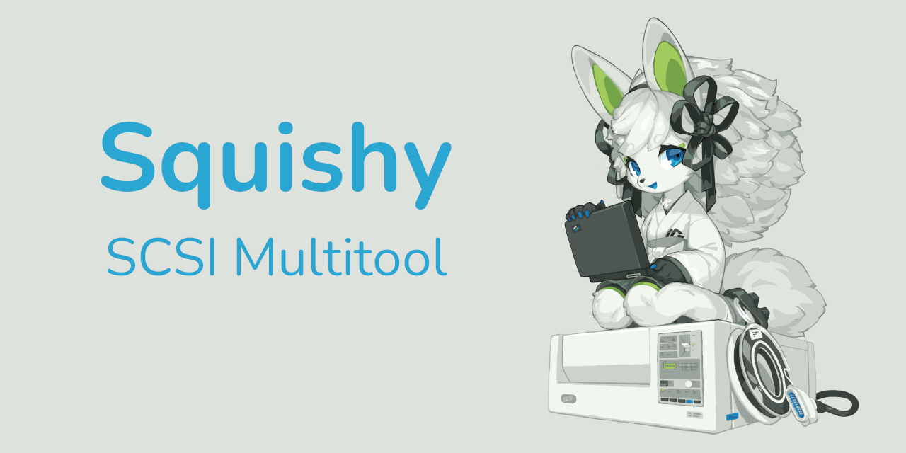

---

## Documentation

For the current version of the [documentation] you can visit [https://docs.scsi.moe/](https://docs.scsi.moe).

## Community

Squishy has a dedicated IRC channel, [#squishy on libera.chat](https://web.libera.chat/#squishy). Join to ask questions, discuss ongoing development, or just hang out.

**NOTE:** Squishy does not have an official discord, nor any endorsed discord servers, for an explanation as to why, see the [F.A.Q.](https://docs.scsi.moe/faq.html)

---

<h3 align="center">Trans Rights Are Human Rights</h3>

[documentation]: https://docs.scsi.moe/
[getting started]: https://docs.scsi.moe/getting_started.html
